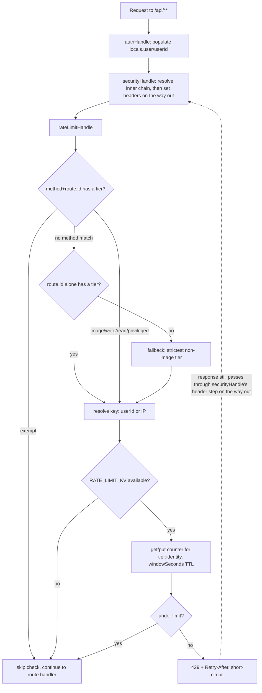

# API Rate Limiting - Plan

## Goal Capsule

- **Objective:** every route under `src/routes/api/` enforces a rate limit sized to its risk tier, with image/file endpoints held to the strictest tier, enforced from one central point rather than per-route code.
- **Authority hierarchy:** the Product Contract and Planning Contract below govern implementation. Research during planning found Cloudflare does not document Rate Limiting binding support for Pages Functions, so a KV-backed counter (KTD1) is the primary mechanism, not a contingency.
- **Stop conditions:** pause and surface a blocker only if KV provisioning itself proves infeasible (e.g. an account-level restriction) — KV is well-established on Pages, so this is unlikely, but it would change the plan's core mechanism and needs a decision, not an improvisation.
- **Execution profile:** code, Standard depth, 5 implementation units.
- **Tail ownership:** the implementer runs the full Verification Contract before declaring the work done; no separate handoff step.

---

## Product Contract

### Summary

Add centrally-enforced, tiered rate limiting to every `/api/**` route. No route in the app enforces any rate limit today. Image and file-related endpoints — the explicit priority — get the strictest tier, reflecting R2 storage/bandwidth and abuse risk; public reads get a looser IP-keyed tier; authenticated writes and privileged (admin-only) routes get user-keyed tiers in between. The secret-gated cron endpoint is excluded. Scope is code-level only, not Cloudflare's dashboard WAF rate-limiting product.

### Problem Frame

The app has 41 `+server.ts` route files and zero rate limiting anywhere — confirmed by an audit of every route, `src/lib/auth/middleware.ts`, and `src/lib/storage/blob.ts`. Existing guardrails on uploads are limited to file-type/size validation (`validateFile`: 10MB cap, MIME allowlist) and a per-entity photo count cap (`MAX_PHOTOS_PER_ENTITY = 6` on `/api/upload` only) — neither is a request-rate control. Several routes have no auth check at all — notably `/api/files` GET, confirmed to have zero authentication or authorization check of any kind — making them the widest surface for anonymous request-flood abuse. Image upload and file-management endpoints carry direct R2 storage/bandwidth cost, making them the highest-value target for stricter throttling. A number of route files also export multiple HTTP methods with different intended tiers from the same file (e.g. `/api/hikes` exports both `GET` and `POST`), which shapes the tier-lookup design in the Planning Contract below.

### Requirements

**Coverage & tiers**

- R1. Every route+method under `src/routes/api/` has an explicit rate-limit tier assignment (public read, authenticated write, image/file mutation, privileged, or exempt) — no route or method is silently uncovered.
- R2. Image and file-related endpoints (`/api/upload`, `/api/posts/cover`, `/api/files`, `/api/files/[id]`, `/api/files/[id]/flag`, `/api/admin/image-flags`) enforce a stricter limit than general CRUD routes.
- R5. `/api/cron/publish-posts` is excluded from user/IP-based rate limiting (already gated by `CRON_SECRET`).

**Behavior**

- R3. A rate-limited request receives HTTP 429 with a `Retry-After` header, not a generic error or silent pass-through.
- R4. Rate limiting is enforced from a single central point, not per-route code, so a new route is covered by default rather than requiring an opt-in change.
- R6. Rate limiting fails open (allows the request) wherever the KV binding is unavailable — local dev, unit tests, or a binding outage — rather than breaking the app, and every fail-open event is logged distinguishably so an extended outage is observable rather than silent.

### Scope Boundaries

**Deferred to Follow-Up Work**

- Cloudflare's zone-level Rate Limiting Rules (WAF/dashboard product) as an additional coarse defense-in-depth layer.
- Migrating this app from Cloudflare Pages to Workers-with-static-assets, which would unlock Cloudflare's native Rate Limiting binding as a more accurate alternative to the KV counter (see KTD1).
- Runtime-configurable thresholds (an admin UI to tune limits) — today's thresholds are code-level config.
- Alerting/paging on `rate_limit_fail_open` events — this plan makes the condition observable via a structured log line; wiring that into an actual on-call/alerting pipeline is separate follow-up work (see Risks & Dependencies).

**Outside this plan**

- `+page.server.ts` form actions and any non-`/api` route.
- Static asset requests (already unmetered on Cloudflare Pages).
- Fixing `/api/files` GET's missing authentication/authorization check — a separate, more urgent gap that this plan's rate limiting only partially mitigates (see Risks & Dependencies).

---

## Planning Contract

### Key Technical Decisions

- **KTD1 — Counter backend: a KV-backed fixed-window counter, not Cloudflare's native Rate Limiting binding.** Verified against current (2026) Cloudflare documentation during planning: the Rate Limiting binding (`type: "ratelimit"`) is **absent** from Cloudflare's documented list of bindings supported by Pages Functions (KV, Durable Objects, R2, D1, Vectorize, Workers AI, Service bindings, Queue Producers, Hyperdrive, Analytics Engine, vars/secrets are the documented set), and community reports describe deploy failures configuring it for Pages projects specifically. This app deploys as a Pages project (`npx wrangler pages deploy .svelte-kit/cloudflare --project-name adventure-spark`), so the binding is not a safe bet — KV is the well-supported, documented path for Pages. This determination is documentation-based, not an empirical Pages-deploy attempt against the native binding; if the upgrade path below is ever revisited, confirm empirically before switching. Two accepted trade-offs versus the native binding: ~60s cross-colo propagation (approximate counts under distributed traffic) and non-atomic read-then-write increments (a client at the edge of a window can slip through slightly more often than a strictly atomic counter would allow — acceptable for abuse mitigation, not a hard guarantee). **Upgrade path:** if this app later migrates from Pages to Workers-with-static-assets (which does support the native binding) or Cloudflare adds Pages support, swap it in behind the same `checkRateLimit` interface.
- **KTD2 — One shared KV namespace, tier thresholds live in code.** Unlike the native binding (whose `limit`/`period` are fixed at deploy time per binding), a KV counter's window is just application logic, so a single KV binding (`RATE_LIMIT_KV`) serves all tiers. A `TIER_CONFIG` table (`{ limit, windowSeconds, keyBy }` per tier) is the single source of truth, mirroring how `src/lib/db/schemas/enums.ts` centralizes enum values and label maps in one place rather than restating them elsewhere. KV keys are namespaced `${tier}:${identity}` so tiers never collide within the shared namespace. `windowSeconds` must stay `>= 60` (Cloudflare KV's `expirationTtl` floor) — a `TIER_CONFIG` entry below that would make every `kv.put` for that tier throw, which `checkRateLimit`'s fail-open path would silently absorb as if it were a KV outage. Validate this at `TIER_CONFIG` definition time (a startup assertion) so a future tuning pass can't introduce that failure mode silently.
- **KTD3 — Central enforcement in `src/hooks.server.ts`, with `rateLimitHandle` innermost.** A new `rateLimitHandle` joins the existing `sequence(authHandle, securityHandle)` as `sequence(authHandle, securityHandle, rateLimitHandle)` — deliberately *after* `securityHandle`, not before. SvelteKit's `sequence()` nests each handle inside the previous one, so a handle positioned after another only has its response processed by the earlier handle's post-`resolve()` code if it sits *inside* that handle's call stack. Since `rateLimitHandle` short-circuits with a 429 `Response` without calling its own `resolve(event)`, placing it last ensures that response still passes back out through `securityHandle`'s header-setting code (`SECURITY_HEADERS`, no-store `Cache-Control`) on its way out — placing it before `securityHandle` would silently ship 429s with none of those headers.
- **KTD4 — Route-tier lookup keyed by HTTP method + route id, not route id alone.** `event.route.id` is SvelteKit's parameterized route identifier (e.g. `/api/hikes/[id]`), not the raw resolved pathname — the right match target since `[id]` segments are slugs (per this repo's URL convention), not literal path fragments. But several `+server.ts` files export multiple HTTP methods that need different tiers from the same route id — `/api/hikes` exports both `GET` (read-tier) and `POST` (write-tier); `/api/ratings` exports `GET`, `POST`, and `DELETE` across two tiers; the admin-managed `*-types` routes export a public `GET` alongside an admin-only `POST` on the same file. A route-id-only key cannot express this. `ROUTE_TIERS` is looked up in two steps: first check a method-specific key (`` `${method} ${routeId}` ``, e.g. `"POST /api/hikes"`); if absent, fall back to a whole-route default keyed by `routeId` alone (used for routes like `/api/upload` or `/api/files/[id]/flag` where every method shares one tier); if neither exists, fall back to the strictest non-image tier so an unclassified route/method still fails safe rather than silently having no limit. This also resolves `/api/files` GET's tier unambiguously: it gets its own method-specific "image" entry, independent of any other method the route might gain later.
- **KTD5 — Keying.** IP-keyed tiers use `event.getClientAddress()` — confirmed, via `@sveltejs/adapter-cloudflare`, to read Cloudflare's edge-set `cf-connecting-ip`, which is not client-spoofable. User-keyed tiers use `locals.userId` (populated by `authHandle`, which runs first in the sequence), falling back to IP if a request somehow reaches an authenticated tier unauthenticated (defense in depth; `requireAuth` already rejects that case upstream).
- **KTD6 — Typed binding and tier lookup.** `src/app.d.ts` types `App.Platform.env.RATE_LIMIT_KV` as `KVNamespace`, and tier config is looked up through `TIER_CONFIG[tier]` (a typed `Record`), not string-indexed against `platform.env` — so a typo in a tier name is a compile error, not a silent runtime fallback.
- **KTD7 — Fail open on infra errors, logged distinguishably.** If `platform.env.RATE_LIMIT_KV` is undefined or a KV call throws, `checkRateLimit` logs a structured, greppable warning (e.g. a `rate_limit_fail_open` event with the tier) and allows the request, rather than breaking the app. This is additive risk reduction, not a new single point of failure, applied uniformly across all tiers including "image" — the alternative (fail-closed on the image tier only) risks breaking legitimate uploads app-wide on a transient KV hiccup, which is worse than the accepted risk of a temporarily-unenforced upload limit. The log line makes the condition observable, not prevented or alerted on — see Risks & Dependencies and the Scope Boundaries note on alerting.
- **KTD8 — Cloudflare's dashboard Rate Limiting Rules are not part of this plan.** The Free plan allows only 1 rule (Business allows more) — insufficient for four tiers — and it's a zone-level product, not application code. Noted as a possible future complementary layer, not implemented here.

### Proposed Tier Defaults

| Tier | Window | Limit | Keyed by | Example routes |
|---|---|---|---|---|
| image | 60s | 20 | user (IP if unauthenticated) | `/api/upload`, `/api/posts/cover`, `/api/files` GET, `/api/files/[id]/flag`, `/api/admin/image-flags` |
| write | 60s | 30 | user | `/api/favorites`, `/api/notes`, `POST/PUT/DELETE /api/ratings`, `POST/PUT/DELETE /api/hikes` |
| read | 60s | 120 | IP | `GET /api/hikes`, `GET /api/camping-sites`, `GET /api/posts`, `/api/stats` |
| privileged | 60s | 60 | user | `/api/moderation`, `/api/users/[id]/role`, `POST /api/amenity-types`, `*/featured` |
| exempt | — | — | — | `/api/cron/publish-posts`, `/api/auth/test-session` |

Rows list example route+method pairs, not whole routes — per KTD4, a route id can appear under more than one tier for different methods (e.g. `/api/hikes` GET is "read" while its POST/PUT/DELETE are "write"). `/api/files` sits entirely in "image" (all its methods, since the whole route is file-related), not split.

The image tier's limit accounts for the existing `MAX_PHOTOS_PER_ENTITY = 6` cap and how `FileUpload.svelte` calls `/api/upload` once per file in a loop: a single legitimate submission (up to 6 photo uploads, possibly plus a cover image and a retry) can approach 8 requests, so a limit of 8 would leave a normal user no margin before hitting the abuse-prevention limit the tier exists to enforce on bad actors. 20/60s clears a full legitimate submission with headroom.

"Privileged" (not "admin") names this tier deliberately — it's independent of, and easily confused with, the existing `role: "admin"` authorization concept in `src/lib/auth/middleware.ts`. A route can require the admin role and carry any tier; the tier is about request volume, not authorization. These are starting defaults, not tuned values — see Risks & Dependencies.

### High-Level Technical Design



### Risks & Dependencies

- **KV counters are approximate, not atomic.** Read-then-write increments mean a client bursting requests at the edge of a window can occasionally exceed the configured limit by a small margin, and ~60s cross-colo propagation means a distributed attacker hitting multiple Cloudflare colos sees a slightly higher effective ceiling than a single-colo client. Accepted for abuse mitigation; not a hard guarantee. This is the direct trade-off of choosing KV over the (Pages-unsupported) native binding.
- **Fixed-window boundary bursts.** Independent of the KV-specific approximations above, the fixed-window algorithm itself lets a client send up to roughly 2x a tier's configured limit by concentrating requests at the boundary between two windows — this holds even for a hypothetical perfectly atomic, single-colo counter. Accepted as a standard fixed-window trade-off; a sliding-window algorithm would close it at the cost of more KV reads per check, not warranted at this scale.
- **Fail-open is uniform across all tiers, including "image."** An extended KV outage temporarily removes rate limiting from the highest-cost tier. Mitigated by the required `rate_limit_fail_open` structured log line (KTD7) so the condition is observable rather than silent — but observability depends on someone or something watching that log line; no alerting/paging integration is in scope here (see Scope Boundaries), so an extended outage could go unnoticed in practice until that follow-up work lands.
- **IP-keyed tiers have two opposite failure modes.** Shared-IP users (schools, offices, NAT) may collectively hit the "read" tier's limit (false positive); a motivated attacker rotating IPs can evade the same tier's per-identity limit (false negative). Both are inherent to any IP-keyed scheme and out of this plan's scope to fully solve — authenticated tiers avoid both by keying on user ID instead.
- **`/api/files` GET has no authentication or authorization check at all**, independent of rate limiting. This plan's "image" tier (20 req/60s) throttles volume against it but does not fix the underlying exposure — the endpoint remains enumerable by `entity_type`/`entity_id` with no access control. This is a separate, more urgent gap that should be tracked and fixed independently of this plan.
- **Numeric thresholds are best-effort defaults**, not derived from real traffic data. Expect to tune after observing production behavior; this is a config change, not a re-architecture. Any future tuning must keep `windowSeconds >= 60` per KTD2.

---

## Implementation Units

### U1. Provision the rate-limit KV namespace and platform types

- **Goal:** Add the Cloudflare configuration needed for the app to receive a KV binding, typed for SvelteKit.
- **Requirements:** R1, R2, R4
- **Dependencies:** none
- **Files:** `wrangler.jsonc` (new, repo root), `src/app.d.ts`, `package.json` (bump `wrangler` devDependency if below the version needed for a Pages config file)
- **Approach:** Run `npx wrangler kv namespace create RATE_LIMIT_KV` (and a `--preview` variant if preview and production deploys are meant to use separate namespaces, matching how `deploy-preview.yml`/`deploy-prod.yml` already run as separate jobs) to provision the actual namespace and obtain its `id`. Add `pages_build_output_dir: ".svelte-kit/cloudflare"` (matches the existing deploy command's output path), a `compatibility_date`, and a `kv_namespaces` entry (`binding: "RATE_LIMIT_KV"`, `id`/`preview_id` from the create step) to `wrangler.jsonc`. Add `App.Platform.env.RATE_LIMIT_KV: KVNamespace` typing in `src/app.d.ts` (currently `interface Platform {}` is commented out).
- **Execution note:** Verify two things early, before U2-U5 build on top of them: (1) that `wrangler pages deploy` picks up this root config without conflicting with the `--project-name`/output-dir flags already hardcoded in `.github/workflows/deploy-preview.yml` / `deploy-prod.yml`; (2) whether adding this config file causes `npm run dev` (`vite dev`) to start populating `platform.env.RATE_LIMIT_KV` via `@sveltejs/adapter-cloudflare`'s dev platform-proxy (it's already a devDependency and newer versions support this) — if so, local dev exercises a real local-persisted KV namespace rather than the "undefined" shape U2's fail-open tests assume, and those tests need to construct that scenario explicitly rather than relying on ordinary local dev to produce it.
- **Patterns to follow:** `workers/scheduler/wrangler.toml` for this repo's existing wrangler-config conventions.
- **Test scenarios:** Test expectation: none -- infra/config only, no runtime behavior to unit test.
- **Verification:** A preview deploy succeeds; `npx wrangler types` generates the `RATE_LIMIT_KV` binding on `App.Platform.env` without error.

### U2. Build the rate-limit utility and tier config

- **Goal:** One module owning tier definitions, method-aware keying, KV-backed counting with fail-open behavior, and the 429 response shape.
- **Requirements:** R1, R2, R3, R4, R6
- **Dependencies:** U1
- **Files:** `src/lib/server/rate-limit.ts` (new), `src/lib/server/rate-limit.test.ts` (new)
- **Approach:** Export `TIER_CONFIG` (tier → `{ limit, windowSeconds, keyBy }`, the single source of truth mirroring `src/lib/db/schemas/enums.ts`'s centralization style, asserting `windowSeconds >= 60` per KTD2), `ROUTE_TIERS` (a map supporting both `` `${method} ${routeId}` `` method-specific keys and bare `routeId` whole-route keys per KTD4), `resolveTier(routeId, method)` (checks the method-specific key, then the whole-route key, then the strictest non-image default), and `checkRateLimit(event, tier)`. This is the first module in the repo consuming a Cloudflare platform binding directly — existing Cloudflare integration (R2 uploads via `src/lib/storage/blob.ts`) goes through the S3-compatible API with env vars, not a `platform.env` binding, so there's no existing local precedent for binding access itself; the fail-open design is what makes that acceptable.
- **Technical design (directional, not implementation-specification):**
  ```
  resolveTier(routeId, method):
    if ROUTE_TIERS[`${method} ${routeId}`]: return ROUTE_TIERS[`${method} ${routeId}`]
    if ROUTE_TIERS[routeId]: return ROUTE_TIERS[routeId]
    return DEFAULT_TIER  // strictest non-image tier

  checkRateLimit(event, tier):
    if tier == "exempt": return { allowed: true }
    config = TIER_CONFIG[tier]
    kv = event.platform?.env?.RATE_LIMIT_KV
    if !kv: log "rate_limit_fail_open" { tier }; return { allowed: true }
    identity = config.keyBy == "ip" ? event.getClientAddress() : (locals.userId ?? event.getClientAddress())
    key = `${tier}:${identity}`
    try:
      record = await kv.get(key, "json")  // { count, windowStart } or null
      now = Date.now()
      if !record or now - record.windowStart > config.windowSeconds * 1000:
        record = { count: 0, windowStart: now }
      if record.count >= config.limit: return { allowed: false }
      record.count += 1
      await kv.put(key, JSON.stringify(record), { expirationTtl: config.windowSeconds })
      return { allowed: true }
    catch:
      log "rate_limit_fail_open" { tier }; return { allowed: true }
  ```
- **Patterns to follow:** `src/lib/server/slug.ts` for this repo's fail-safe helper style (a plain exported function, no thrown errors for expected outcomes); `src/lib/utils/slugify.test.ts` for vitest conventions. (`src/lib/auth/middleware.ts`'s `error()`-throwing style does not apply here — `checkRateLimit` never throws; the 429 is constructed in `hooks.server.ts`, U3.)
- **Test scenarios:**
  - Happy path: a `(method, routeId)` pair with a method-specific entry (e.g. `POST /api/hikes`) resolves to that tier, distinct from the same route id's other method.
  - Happy path: a route id with only a whole-route entry (e.g. `/api/upload`) resolves to that tier regardless of method.
  - Happy path: `checkRateLimit` returns `allowed: true` under the tier's limit and `allowed: false` at/over it, using a fake/in-memory KV implementing `get`/`put`.
  - Edge case: an unmapped `(method, routeId)` pair falls back to the strictest non-image default tier instead of throwing.
  - Edge case: a user-keyed tier with no `locals.userId` falls back to IP-based keying instead of throwing.
  - Edge case: a window boundary — a record older than `windowSeconds` resets the count instead of continuing to accumulate.
  - Edge case: `TIER_CONFIG` construction throws (or fails an assertion) if any tier's `windowSeconds < 60`.
  - Error path: `event.platform.env` undefined (the fail-open shape, constructed explicitly rather than assumed from local dev — see U1's execution note) → fails open, `rate_limit_fail_open` logged, no exception raised.
  - Error path: `kv.get`/`kv.put` throws → fails open, same as the missing-binding case.

### U3. Wire enforcement into hooks.server.ts and cover image/file endpoints

- **Goal:** Enforce the tiers in the request pipeline — with `rateLimitHandle` positioned so its 429s still receive security headers — and correctly classify the priority image/file endpoints into the strict tier.
- **Requirements:** R1, R2, R3, R5
- **Dependencies:** U1, U2
- **Files:** `src/hooks.server.ts`, `src/hooks.server.test.ts` (new), `src/lib/server/rate-limit.ts` (tier table entries)
- **Approach:** Insert `rateLimitHandle` as the last handle: `sequence(authHandle, securityHandle, rateLimitHandle)` (see KTD3 — this ordering, not `rateLimitHandle` before `securityHandle`, is what makes 429 responses still carry `SECURITY_HEADERS` and the no-store `Cache-Control`). When `checkRateLimit` reports not allowed, return a 429 `Response` directly (short-circuiting without calling `resolve(event)`), with a `Retry-After` header derived from the tier's `windowSeconds`. Assign `/api/upload`, `/api/posts/cover`, `/api/files` (all methods, whole-route entry), `/api/files/[id]`, `/api/files/[id]/flag`, `/api/admin/image-flags` to the "image" tier; assign `/api/cron/publish-posts` to "exempt".
- **Patterns to follow:** the existing `securityHandle` in `src/hooks.server.ts` for how a `Handle` composes into `sequence(...)` and mutates/returns a `Response` directly rather than throwing.
- **Test scenarios:**
  - Happy path: a request under the image tier's limit passes through to the route handler unchanged.
  - Happy path: exceeding the image tier's limit on `/api/upload` returns 429 with `Retry-After`, and the underlying route handler is never invoked (assert via spy/mock).
  - Integration: a 429 response still carries `SECURITY_HEADERS` and the no-store `Cache-Control` (proves the sequence-ordering decision in KTD3).
  - Integration: `/api/cron/publish-posts` is unaffected by the limiter at any request volume (tier "exempt").
  - Integration: a non-API route (e.g. `/hikes`) is never rate-limited (tier table only matches `/api/*` route ids).
  - Edge case: two different users hitting `/api/upload` get independent limits (keyed by `locals.userId`, not sharing a bucket).

### U4. Classify remaining API routes into read/write/privileged tiers

- **Goal:** Complete tier coverage for the rest of the 41 routes (and their individual HTTP methods) so nothing under `/api/` is unclassified, with a test that proves completeness rather than asserting it by inspection.
- **Requirements:** R1, R5
- **Dependencies:** U3
- **Files:** `src/lib/server/rate-limit.ts` (tier table), `src/lib/server/rate-limit.test.ts`
- **Approach:** Add whole-route "read" entries for routes that are entirely public GETs (series, stats, trail-types, councils). For routes that mix a public GET with an authenticated or admin-only mutating method on the same file, add method-specific entries instead of a whole-route one: `GET /api/hikes` / `GET /api/camping-sites` / `GET /api/backpacking` / `GET /api/posts` / `GET /api/ratings` / `GET /api/feature-types` / `GET /api/facility-types` / `GET /api/amenity-types` → "read"; their `POST`/`PUT`/`DELETE` counterparts, plus `favorites`, `notes`, `alterations`, `profile` (whole-route, since those files have no unauthenticated method) → "write"; `POST /api/feature-types` / `POST /api/facility-types` / `POST /api/amenity-types`, plus `moderation`, `users/[id]/role`, and the `*/featured` routes (whole-route, admin-only files) → "privileged"; `/api/auth/test-session` → "exempt" (dev-only, already 404s in production).
- **Patterns to follow:** the tier-table shape and two-step `resolveTier` lookup established in U2/U3.
- **Test scenarios:**
  - Happy path: `GET /api/hikes` resolves to "read" while `POST /api/hikes` resolves to "write", proving the method-specific override works on a route id that also has a whole-route-shaped neighbor.
  - Happy path: a sampled admin-only mutating route sharing a file with a public GET (`POST /api/amenity-types`) resolves to "privileged" while `GET /api/amenity-types` resolves to "read".
  - Happy path: a sampled whole-route write endpoint (`/api/favorites` POST) resolves to "write" regardless of method, since favorites has no public GET.
  - Completeness: use `import.meta.glob("/src/routes/api/**/+server.ts", { eager: true })` inside the vitest test to enumerate every actual route file, derive its SvelteKit route id (strip `src/routes` and `+server.ts`, keep `[param]` segments as-is), inspect the imported module's exports to find which HTTP methods (`GET`/`POST`/`PUT`/`PATCH`/`DELETE`) it actually implements, and assert `resolveTier(routeId, method)` returns something other than the strictest-default fallback for every real `(routeId, method)` pair — so a newly added route or method without an explicit tier assignment fails the test instead of silently resolving to the default.

### U5. End-to-end coverage and tuning notes

- **Goal:** Prove the limiter works against a real (or emulated) Cloudflare runtime, not just unit-mocked KV.
- **Requirements:** R1, R2, R3
- **Dependencies:** U3, U4
- **Files:** `e2e/rate-limiting.anon.spec.ts` (new)
- **Approach:** Add a Playwright spec, importing `test`/`expect` from `e2e/fixtures/base-test.ts` (matching every other spec's convention, not raw `@playwright/test`), that fires requests past the "image" tier's threshold and asserts a 429 with `Retry-After` once the threshold is crossed, then confirms recovery after the window elapses. If the chosen route needs a valid entity id, pull one via `e2e/fixtures/helpers.ts` (e.g. `getHikeId()`) rather than hardcoding one.
- **Execution note:** `test:e2e:ci` runs against a deployed preview environment; confirm U1's KV binding is present there first — a missing binding fails open (by design) and would make this test pass for the wrong reason.
- **Test scenarios:**
  - Happy path: requests under the threshold all succeed.
  - Boundary: the Nth request (at the configured limit) succeeds; the N+1th returns 429.
  - Recovery: a subsequent request succeeds again after the window elapses.

---

## Verification Contract

| Command | Applies to | Gate |
|---|---|---|
| `npm run test:unit` | U2, U3, U4 | `rate-limit.test.ts` covers tier resolution, keying, window reset, fail-open behavior, and the `windowSeconds >= 60` guard; `hooks.server.test.ts` covers enforcement and header propagation |
| `npm run test:e2e:ci` | U5 | 429/`Retry-After`/recovery behavior against a preview deploy |
| `npm run check` | U1, U2 | New `Platform.env` types and rate-limit module type-check cleanly |
| `npm run lint` | all | Repo formatting/lint conventions |

## Definition of Done

- Every actual `(route, method)` pair under `src/routes/api/` has an explicit tier assignment (U4's completeness test, driven by `import.meta.glob`, passes).
- Image/file endpoints enforce the "image" tier, including `/api/files` GET specifically (no lingering contradiction with a looser tier); `/api/cron/publish-posts` is confirmed exempt.
- Rate-limited requests return 429 with `Retry-After` and still carry `SECURITY_HEADERS`/no-store `Cache-Control` (U3's sequence-ordering test in `hooks.server.test.ts` passes).
- The limiter fails open when `RATE_LIMIT_KV` is unavailable, logging a `rate_limit_fail_open` event each time (U2's tests pass).
- `npm run test:unit`, `npm run test:e2e:ci`, `npm run check`, and `npm run lint` all pass.
- Any dead-end code from U1's local-dev-binding verification (e.g. an abandoned assumption about `platform.env` always being undefined locally) is corrected or removed before calling this done.
