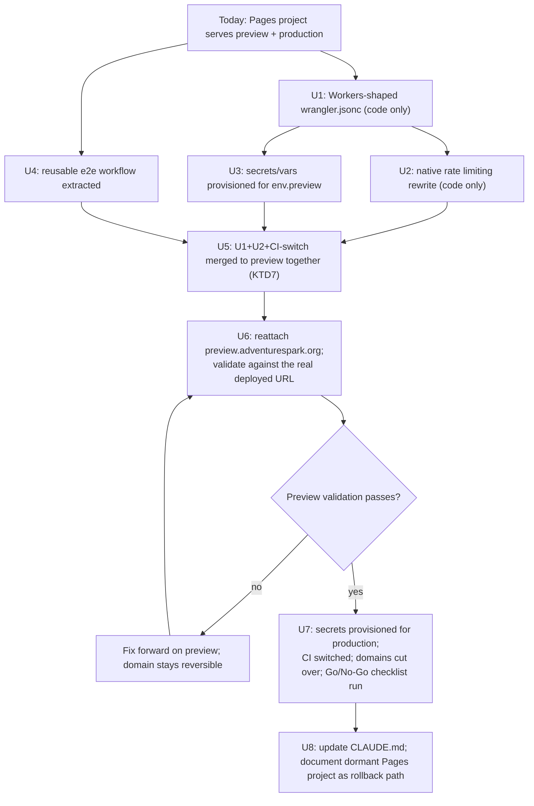

# Migrate to Cloudflare Workers with Static Assets - Plan

## Goal Capsule

- **Objective:** move the app's Cloudflare deployment from Pages to Workers-with-static-assets, landing and fully validating in preview before any production change, so the native Rate Limiting binding (unavailable on Pages Functions) can replace the KV-backed counter from `docs/plans/2026-07-06-001-feat-api-rate-limiting-plan.md`.
- **Authority hierarchy:** the Product Contract and Planning Contract below govern. The user explicitly confirmed two scope decisions during planning: production cutover is part of this plan's scope (U7), not a separate manual follow-up, and the KV rate-limit path is dropped entirely rather than kept as a fallback (U2). A documented, deliberately-not-taken alternative (Durable Objects, which works on Pages Functions) is recorded below rather than silently omitted.
- **Stop conditions:** pause and surface a blocker if preview validation (U6) fails in a way that isn't a straightforward config fix — do not proceed to production cutover (U7) on an unresolved preview problem. That dependency is the entire point of the phased approach. Also pause if, immediately before U7, there's reason to believe production actually has real users now — the "nobody uses it yet" premise this plan's risk posture rests on needs to still be true at execution time, not just at planning time.
- **Execution profile:** code, Deep depth, 8 implementation units, phased (preview lands and validates before production is touched).
- **Tail ownership:** the implementer runs the full Verification Contract before declaring each phase done; production cutover (U7) additionally requires U6's preview validation to have passed first.

---

## Product Contract

### Summary

Replace the app's Cloudflare Pages deployment with a Cloudflare Worker using static assets, using the same `@sveltejs/adapter-cloudflare` build output (no framework/adapter changes — only `wrangler.jsonc` and the deploy commands change). This unlocks the native Rate Limiting binding, which Cloudflare does not support on Pages Functions, letting `src/lib/server/rate-limit.ts` drop its KV-backed fixed-window counter for a simpler, atomic binding call. This is a deliberate improvement made while the cost of getting it wrong is low — nobody uses the site in production yet — not a reaction to an incident; the KV counter's approximations were already accepted as tolerable in the prior plan, and this migration trades planning-time effort now for a stronger guarantee later, before real traffic makes the same migration riskier. The migration lands and is fully validated against the real `preview.adventurespark.org` domain first; production cutover is a later, separate unit in the same plan, gated on preview passing.

### Problem Frame

`docs/plans/2026-07-06-001-feat-api-rate-limiting-plan.md`'s KTD1 already documents why the KV-backed counter was chosen over the native `ratelimits` binding: Cloudflare's Pages Functions bindings documentation does not list `ratelimit` as a supported type, and the app deploys via `wrangler pages deploy`. That KV counter carries two accepted trade-offs it wouldn't have on the native binding: non-atomic read-then-write increments and ~60s cross-colo propagation lag (see that plan's Risks & Dependencies). Moving to a Worker removes the platform constraint that forced the KV workaround in the first place — confirmed directly by Cloudflare's own Pages-to-Workers migration guide, which lists Rate Limiting as supported on Workers and unsupported on Pages.

**A smaller-blast-radius alternative exists and was considered:** Durable Objects, which *are* documented as supported on Pages Functions (per the same bindings list cited above), could back an atomic counter without leaving Pages at all — no CI, secrets, or DNS migration. This plan doesn't take that path because the user separately asked how a Workers migration would work and explicitly chose to pursue it now, while the cost of doing so is low; a Durable-Object-based counter remains a smaller, valid alternative if this migration's cost/risk ever looks disproportionate before it lands. Recorded here rather than silently omitted.

Separately, the deploy pipeline itself needs to change: Workers use `wrangler deploy` instead of `wrangler pages deploy`, custom domains attach as Worker routes instead of Pages project domains, and Workers serve static assets *before* invoking the Worker by default (the opposite of Pages' default), which matters for `/api/**` routing. Cloudflare Pages today reads all runtime secrets (WorkOS credentials, `DATABASE_URL`, R2 credentials, `CRON_SECRET`) from its own dashboard-configured environment variables — these do not carry over to a Worker automatically and must be explicitly reprovisioned. The repo already has two working precedents to build on: `workers/scheduler/wrangler.toml` (a bare `wrangler deploy` Worker, deployed via `deploy-prod.yml`'s `deploy-scheduler` job) and `scripts/upload-secrets.cjs` (already bulk-provisions secrets today via `wrangler pages secret bulk`, aliased as `npm run secrets:upload:preview`/`secrets:upload:prod`).

### Requirements

**Deployment target**

- R1. The app builds and serves identically to today — `@sveltejs/adapter-cloudflare`'s output (`main: .svelte-kit/cloudflare/_worker.js`, `assets.directory: .svelte-kit/cloudflare`) is unchanged; only `wrangler.jsonc`'s shape and the deploy commands change.
- R2. `/api/**` routes continue to invoke the Worker (not served as static assets) — Workers-with-static-assets' `run_worker_first` default differs from Pages and must be configured explicitly.
- R3. Preview and production remain two distinct deploy targets with their own custom domains, matching today's `preview` vs `main` branch split.
- R8. Every runtime secret/var the app currently reads from Pages' dashboard-configured environment variables is explicitly reprovisioned on the Worker (both `env.preview` and production) before that environment's traffic is cut over.

**Phased rollout**

- R4. The migration lands and is fully validated against the real `preview.adventurespark.org` domain — including confirming the rate limiter actually returns 429s, which was unverifiable on Pages — before production is touched.
- R5. Production cutover (custom domain reattachment) is reversible: the existing Pages project stays intact and undeployed-to during the migration, so rollback is reattaching domains to it, bounded by the data-compatibility caveat in KTD8.

**Rate limiting**

- R6. `src/lib/server/rate-limit.ts` drops the KV-backed counter entirely (`RATE_LIMIT_KV`, the fixed-window get/put logic, the `windowSeconds >= 60` guard) in favor of the native Rate Limiting binding — one binding per tier, called directly.
- R7. The existing method+route tier classification (`ROUTE_TIERS`, `resolveTier`) is unchanged; `hooks.server.ts`'s `rateLimitHandle` keeps its response shape (including the `Retry-After` header), sourcing the period value from a small code-side mirror rather than from `checkRateLimit`'s now-narrower return (see KTD5).

### Scope Boundaries

**Deferred to Follow-Up Work**

- Deciding whether/when to delete the old Cloudflare Pages project — it's left intact and dormant as a rollback safety net; an explicit decision to remove it comes later, after some period of confidence in the Workers deployment (see Open Questions), bounded by the schema-drift caveat in KTD8.
- Any further rate-limit threshold tuning — out of scope here; thresholds carry over unchanged from the KV-based plan.
- An automated check that `env.preview` and production `wrangler.jsonc` blocks stay in sync for bindings/secrets on an ongoing basis (KTD4's non-inheritance gotcha) — this plan handles the initial parity; guarding against future drift (e.g. a fifth tier or new secret added later and forgotten in one block) is a separate, smaller follow-up.

**Outside this plan**

- `workers/scheduler/` — already a separate, plain `wrangler deploy` Worker; untouched by this migration.
- Any change to `@sveltejs/adapter-cloudflare` version, `svelte.config.js`, or the SvelteKit build itself (R1 — the build output is identical for both targets).

---

## Planning Contract

### Key Technical Decisions

- **KTD1 — Build output does not change.** Per SvelteKit's Cloudflare adapter docs, the Workers-with-static-assets target uses the exact same build artifact as Pages: `main: ".svelte-kit/cloudflare/_worker.js"`, `assets.directory: ".svelte-kit/cloudflare"`. Only `wrangler.jsonc`'s shape and the deploy command change — `npm run build` and the adapter config are untouched.
- **KTD2 — `compatibility_flags: ["nodejs_als"]` is required on the Workers target.** SvelteKit's adapter docs specify this flag for Workers deploys (AsyncLocalStorage support for request context); it isn't required (and isn't currently present) for the Pages target.
- **KTD3 — `assets.run_worker_first: ["/api/*"]` is required.** Workers-with-static-assets serves static files ahead of the Worker by default — the opposite of Pages' default (Functions-first). Every request currently flows through `hooks.server.ts` (auth, security headers, rate limiting); without this, `/api/**` requests would be misrouted. The glob matches any depth under `/api/`, not just one segment, so it correctly covers paths like `/api/admin/image-flags` and `/api/files/[id]/flag` — worth an explicit smoke-test in U6/U7's verification since it's load-bearing for the whole app, not just top-level routes.
- **KTD4 — Preview and production are separate Worker resources sharing one config, not "one Worker, two environments."** Wrangler's `env` blocks are the standard mechanism for a preview/production split, but `wrangler deploy --env preview` deploys a **distinctly-named Worker** (`<name>-<env>`, i.e. `adventure-spark-preview`) — a separate resource in the dashboard, not the same running service under different config. This is still the right approach (it mirrors today's Pages "one project, two deploy targets" shape closely enough, and each gets its own custom domain), but the plan must not describe it as one Worker serving both. Deploy commands: `wrangler deploy --env preview` (preview) and `wrangler deploy` (production, top-level config). **Bindings do not inherit into `env` blocks** — `assets`/`main`/`compatibility_flags` are scalar/object keys that do carry down, but array-style bindings (`ratelimits`, and secrets set via `wrangler secret put`/`wrangler secret bulk`) must be explicitly duplicated into `env.preview`, or that Worker gets none of them.
- **KTD5 — Rate limiting: one native `ratelimits` binding per tier, replacing `kv_namespaces`, duplicated into `env.preview` with distinct `namespace_id`s.** Per the existing rate-limit plan's KTD2 (already anticipated this): four bindings — `RATE_LIMITER_IMAGE`, `RATE_LIMITER_WRITE`, `RATE_LIMITER_READ`, `RATE_LIMITER_PRIVILEGED` (explicit names, since `event.platform.env` property access needs literal names from the generated types, not dynamic tier-string indexing) — each `simple: { limit, period: 60 }` using today's `TIER_CONFIG` numeric values (image: 20, write: 30, read: 120, privileged: 60), present in **both** the top-level and `env.preview` blocks (KTD4). `namespace_id`s **must** differ between the two environments — not "ideally," but required — so preview testing (or a probe against the low-stakes preview environment) can't exhaust production's counters or vice versa; this is itself an abuse-prevention property, and the plan exists to strengthen that control, not leave a new gap in it. Once this lands, `wrangler.jsonc` is the source of truth for `limit`/`period` as configured on the binding itself; `checkRateLimit` collapses to a per-tier binding lookup plus one `.limit({ key })` call, returning only `{ allowed: result.success }` (the native binding's response carries no period/retry-after value). Two small code-side mirrors survive this simplification, deliberately, because the binding itself can't supply them at runtime: a `TIER_KEY_BY: Record<Tier, "ip" | "user">` map (identity resolution — the binding has no concept of this) and a `TIER_PERIOD_SECONDS: Record<Tier, number>` map (used only to set the `Retry-After` header in `hooks.server.ts`, mirroring wrangler.jsonc's `period` values — currently `60` for every tier). `resolveTier`/`ROUTE_TIERS`'s method+route lookup is unchanged; only what happens after a tier is resolved changes.
- **KTD6 — Secrets/vars are reprovisioned via the existing bulk-upload tooling, not 22 individual commands.** The repo already has `scripts/upload-secrets.cjs` (aliased `npm run secrets:upload:preview`/`secrets:upload:prod`), which today reads an `.env`-shaped file and calls `wrangler pages secret bulk secrets.json --project-name adventure-spark --env <env>`. Update it to call `wrangler secret bulk <file> --env <env>` instead (drop `pages` and `--project-name`, confirmed as a supported Workers command in the installed wrangler CLI) and reuse it for both environments, rather than hand-typing `wrangler secret put` once per secret per environment (11 secrets × 2 environments = 22 error-prone manual commands). Covers: `WORKOS_API_KEY`, `WORKOS_CLIENT_ID`, `WORKOS_ORGANIZATION_ID`, `WORKOS_COOKIE_PASSWORD`, `DATABASE_URL`, `R2_ACCESS_KEY_ID`, `R2_SECRET_ACCESS_KEY`, `R2_BUCKET_NAME`, `R2_ACCOUNT_ID`, `CRON_SECRET`, `ORIGIN`. `R2_PUBLIC_URL` and other non-secret config go in `wrangler.jsonc`'s `vars` instead. Skipping this step entirely is a hard outage, not a degraded-mode failure — e.g. `workosAuth` throws immediately if its env vars are unset — so it must happen before U6/U7's respective cutovers, not be discovered by the first failing request. Separately, confirm `CLOUDFLARE_API_TOKEN` (used by CI) carries Workers Scripts + Routes/Custom-Domain edit permission for the target zone before relying on `wrangler deploy` to auto-attach a custom domain — the scheduler Worker's existing successful `wrangler deploy` job proves script-deploy permission, not route-attach permission, since it declares no routes.
- **KTD7 — U1-U2-U5 must land as one atomic change, not merged independently.** Landing the Workers-shaped `wrangler.jsonc` (U1) and the native-binding rewrite of `rate-limit.ts` (U2) onto `preview` while CI still deploys via `wrangler pages deploy` (before U5's CI switch) creates two real problems: (a) it's unverified whether `wrangler pages deploy` even tolerates a Workers-shaped config (`main`/`assets` instead of `pages_build_output_dir`) without erroring; (b) if it does tolerate it, `rate-limit.ts` now calls a `ratelimits` binding that doesn't exist under Pages Functions, so every request silently fails open for as long as that state persists. This is a different situation from the fail-open path's normal steady-state role (a safety net for a transient infra hiccup) — here the binding wouldn't just occasionally be unavailable, it would be *permanently* absent under Pages, a known-broken state rather than a rare degraded one. U1, U2, and U5 (the CI switch itself) land in a single PR/push to `preview`, so there is no window where Workers-shaped code runs on the Pages pipeline.
- **KTD8 — Rollback is domain reattachment, not a code revert, bounded by schema drift.** The existing Pages project stays intact and simply stops receiving deploys during the migration. If the Workers deploy has a problem after cutover, rollback is reattaching the affected custom domain(s) back to the Pages project — no data migration, since app state (Neon, R2) is external to both compute models, and cookies have no `domain` attribute (host-only), so they're unaffected by a compute-backend change on the same hostname. This reasoning holds at the instant of cutover, but `deploy-prod.yml`'s `migrate` job keeps running `db:migrate` against the shared Neon database on every `main` push after cutover, independent of which compute backend is live — so the dormant Pages project's frozen code becomes progressively less schema-compatible the longer it sits idle. Rollback is fully safe immediately after cutover; treat it as unverified (not guaranteed safe) once a schema migration has landed since the Pages project was last deployed to.
- **KTD9 — Preview validation needs a new gate; the existing e2e job doesn't provide one, and shouldn't be duplicated wholesale.** `deploy-preview.yml`'s `test` job and `deploy` job both depend only on `migrate` and run in **parallel** — the e2e suite currently validates a local `npm run dev` build of the branch, not the actually-deployed preview site (no `PLAYWRIGHT_BASE_URL` is set in CI). Rather than copy the `test` job's ~16 secrets/env-vars and Playwright-install steps into a second job wholesale, extract the e2e run into a reusable workflow (`on: workflow_call`, a `base-url` input, `secrets: inherit`) called twice: once as today (no `base-url`, local dev server, parallel with deploy) and once with `needs: deploy` and `base-url: https://preview.adventurespark.org`. This is a small, contained extraction whose only purpose is avoiding ~16-var duplication for R4's gate — not a general CI refactor riding along with the migration.

### High-Level Technical Design

U1 must land first (it creates the `env.preview` block U2 and U3 both edit); U2, U3, and U4 can then proceed in any order or in parallel. U5 is the first point they must all be together, landing atomically per KTD7.

### Risks & Dependencies

- **Custom domain reattachment has a brief routing window.** Detaching a domain from the Pages project and attaching it to the Worker isn't instantaneous or transactional, and Cloudflare does not document a specific propagation SLA for this operation. For preview this is low-stakes (only the author is watching); for production, do the cutover deliberately and confirm immediately rather than walking away mid-change.
- **Missing secrets is a hard outage, not a degraded mode (KTD6).** This is the single highest-severity risk in this plan — silently forgetting one WorkOS or DB var breaks the entire app on first request, not just a feature. U3 and U7 exist specifically to make this an explicit, checked step rather than a discovery made via a production incident.
- **Landing U1/U2 independently of the CI switch creates a silent rate-limiting gap (KTD7).** Addressed by treating U1+U2+U5 as one atomic push, not a sequencing suggestion to skip.
- **The production Worker's `workers.dev` URL stays reachable unless explicitly disabled**, bypassing any zone-level Cloudflare protections (WAF, bot management) scoped to the custom domains. U7 disables it (`workers_dev: false`) once the custom domain routes are confirmed working.
- **A dormant Pages project is a rollback asset now, a schema-drift risk over time, and clutter eventually.** Per KTD8, deliberately not decommissioning it during this plan, but its rollback guarantee is bounded — see KTD8. Left as an explicit open question (below) rather than silently forgotten.
- **A future prerendered page would silently skip `hooks.server.ts`.** Assets-first fallthrough (KTD3's default, scoped by `run_worker_first`) means a statically-generated page never hits auth/security-header/rate-limit logic. Not a problem today (no routes use `prerender`), but worth knowing if that ever changes.
- **This plan depends on `docs/plans/2026-07-06-001-feat-api-rate-limiting-plan.md`'s implementation being on `main`/`preview`** — U2 rewrites `rate-limit.ts`, `rate-limit.test.ts`, and `wrangler.jsonc`'s bindings as they exist after that plan's work, not from scratch.

### Open Questions

- When is it safe to delete the old Pages project entirely (vs. leaving it dormant indefinitely as rollback insurance)? Deferred — revisit after production has run on Workers for a period the user is comfortable with, and no sooner than the point where a same-day rollback is no longer the goal (see KTD8's schema-drift bound).

---

## Implementation Units

### U1. Wrangler config: Pages shape → Workers-with-static-assets shape

- **Goal:** Restructure `wrangler.jsonc` for the Workers/static-assets target. Per KTD7, this unit's changes are not merged to `preview` independently — they land together with U2 and U5.
- **Requirements:** R1, R2, R3
- **Dependencies:** none
- **Files:** `wrangler.jsonc`
- **Approach:** Replace `pages_build_output_dir` with `main: ".svelte-kit/cloudflare/_worker.js"` and `assets: { directory: ".svelte-kit/cloudflare", binding: "ASSETS", run_worker_first: ["/api/*"] }` (KTD1, KTD3); add `compatibility_flags: ["nodejs_als"]` (KTD2); add an `env.preview` block (KTD4) re-declaring `main`/`assets`/`compatibility_flags` (these do inherit, but stating them explicitly avoids relying on inheritance rules that don't apply uniformly across key types). Do not add `routes`/custom domains yet (U6, U7).
- **Patterns to follow:** `workers/scheduler/wrangler.toml` for this repo's existing plain-Worker config shape (`main` + `compatibility_date`, no Pages-specific keys).
- **Test scenarios:** Test expectation: none -- config only.
- **Verification:** `npx wrangler types` regenerates `worker-configuration.d.ts` (including the `ASSETS` binding) without error; `npm run check` passes.

### U2. Replace the KV rate-limit counter with the native Rate Limiting binding

- **Goal:** Drop `rate-limit.ts`'s KV-backed fixed-window counter for the native `ratelimits` binding — one binding per tier, atomic, no window-math to maintain.
- **Requirements:** R6, R7
- **Dependencies:** U1
- **Files:** `wrangler.jsonc`, `src/lib/server/rate-limit.ts`, `src/lib/server/rate-limit.test.ts`, `src/hooks.server.ts`, `src/hooks.server.test.ts`
- **Approach:** Add four `ratelimits` entries to `wrangler.jsonc`'s top-level config and to `env.preview` (KTD4/KTD5): `RATE_LIMITER_IMAGE`, `RATE_LIMITER_WRITE`, `RATE_LIMITER_READ`, `RATE_LIMITER_PRIVILEGED`, each `simple: { limit, period: 60 }` (20/30/120/60 respectively), with distinct `namespace_id`s per environment (required, KTD5); remove the `kv_namespaces` (`RATE_LIMIT_KV`) entry from both blocks. Rewrite `checkRateLimit` to look up the resolved tier's binding by its fixed name on `event.platform.env` and call `.limit({ key })`, returning `{ allowed: result.success }`; remove the KV get/put/window-math and the `windowSeconds >= 60` guard (`assertValidTierConfig`). Replace `TIER_CONFIG` with the two slim maps from KTD5 (`TIER_KEY_BY`, `TIER_PERIOD_SECONDS`) — `resolveIdentity` keys off the former, `hooks.server.ts`'s `Retry-After` header keys off the latter (`rateLimitHandle` currently destructures `windowSeconds` straight off `checkRateLimit`'s return; since the native binding's response carries no such value, `rateLimitHandle` reads it from `TIER_PERIOD_SECONDS[tier]` directly instead). `resolveTier`/`ROUTE_TIERS` and the fail-open behavior when a binding is unavailable stay conceptually the same. Regenerate `App.Platform.env` typing via `wrangler types` once the `ratelimits` config is in place.
- **Patterns to follow:** the existing `checkRateLimit`/`resolveTier` structure in `src/lib/server/rate-limit.ts` — this is a targeted rewrite of the counting logic, not a redesign of the tier/routing model.
- **Test scenarios:**
  - Happy path: `checkRateLimit` returns `allowed: true` when the resolved tier's binding reports `success: true`, and `allowed: false` when `success: false`, using a fake binding object implementing `.limit()`.
  - Happy path: `hooks.server.ts`'s 429 response's `Retry-After` header reflects `TIER_PERIOD_SECONDS[tier]`, not a value read off `checkRateLimit`'s return.
  - Edge case: `resolveTier`'s method+route lookup and default-tier fallback behavior are unchanged (existing tests carry over unmodified).
  - Error path: the resolved tier's binding is undefined on `event.platform.env` → fails open, warning logged, no exception raised.
  - Error path: `.limit()` throws → fails open, same as the missing-binding case.
  - Rewrite required, not just addition: existing tests referencing `TIER_CONFIG.<tier>.limit` (used today to loop N times up to the limit) must be rewritten against the fake binding's `.limit()` responses instead, since those numeric fields no longer exist in code.
  - Removed: the window-boundary-reset and `windowSeconds < 60` guard tests no longer apply and should be deleted, not left as dead assertions.

### U3. Provision secrets and vars for `env.preview`

- **Goal:** Make the preview Worker actually able to serve requests — per KTD6, this is a hard prerequisite, not an afterthought.
- **Requirements:** R8
- **Dependencies:** U1
- **Files:** `scripts/upload-secrets.cjs`, `wrangler.jsonc` (`vars` addition to `env.preview` for `R2_PUBLIC_URL`)
- **Approach:** Update `scripts/upload-secrets.cjs`'s `wrangler pages secret bulk secrets.json --project-name adventure-spark --env ${env}` call to `wrangler secret bulk secrets.json --env ${env}` (KTD6 — drop `pages` and `--project-name`), then run `npm run secrets:upload:preview` with the same values currently configured in the Pages project's preview environment variables (`WORKOS_API_KEY`, `WORKOS_CLIENT_ID`, `WORKOS_ORGANIZATION_ID`, `WORKOS_COOKIE_PASSWORD`, `DATABASE_URL`, `R2_ACCESS_KEY_ID`, `R2_SECRET_ACCESS_KEY`, `R2_BUCKET_NAME`, `R2_ACCOUNT_ID`, `CRON_SECRET`, `ORIGIN`). Add `R2_PUBLIC_URL` as a `vars` entry in `wrangler.jsonc`'s `env.preview` block instead. Separately, confirm `CLOUDFLARE_API_TOKEN` has Workers Routes/Custom-Domain edit permission for the target zone (KTD6) — needed by U6, not this unit, but worth confirming early since it can't be checked without a real deploy attempt.
- **Test scenarios:** Test expectation: none -- infra provisioning; verified by U6's real preview requests succeeding rather than throwing.
- **Verification:** `wrangler secret list --env preview` shows all required secret names present.

### U4. Extract the e2e workflow into a reusable job (KTD9)

- **Goal:** Add the post-deploy validation gate R4 requires, without duplicating ~16 secrets/env-vars into a second job.
- **Requirements:** R4
- **Dependencies:** none
- **Files:** `.github/workflows/e2e-tests.yml` (new, reusable `workflow_call`), `.github/workflows/deploy-preview.yml`
- **Approach:** Extract the existing `test` job's steps (checkout, setup-node, install, Playwright browser install, `npm run test:e2e:ci`, upload report) into a reusable workflow accepting an optional `base-url` input, using `secrets: inherit` to keep the existing ~16 secrets flowing through unchanged. Update `deploy-preview.yml`'s `test` job to call it (no `base-url`, same parallel-with-deploy behavior as today).
- **Patterns to follow:** the existing `test` job in `deploy-preview.yml` — this is an extraction, not a rewrite of its logic.
- **Test scenarios:** Test expectation: none -- CI/workflow config; verified by the existing preview push behavior being unchanged after extraction.

### U5. Merge U1+U2+CI-switch to `preview` together (KTD7)

- **Goal:** Land the Workers-shaped config and native rate limiting on `preview` in the same push that also switches CI to deploy via `wrangler deploy --env preview`, so there is no window where Workers-shaped code runs on the old Pages pipeline.
- **Requirements:** R3, R4
- **Dependencies:** U1, U2, U3, U4
- **Files:** `.github/workflows/deploy-preview.yml`, `package.json` (`deploy:preview` script)
- **Approach:** Replace `npx wrangler pages deploy .svelte-kit/cloudflare --project-name adventure-spark --branch preview` with `npx wrangler deploy --env preview`. Add a second call to U4's reusable e2e workflow with `needs: deploy` and `base-url: https://preview.adventurespark.org`, so the deployed artifact — not just local dev — gets validated on every future preview push, not only this one.
- **Patterns to follow:** `deploy-prod.yml`'s `deploy-scheduler` job for how a bare `wrangler deploy` step is already wired into this repo's CI (same secrets, same shape).
- **Test scenarios:** Test expectation: none -- CI/workflow config; proven by the real preview push in U6, not by a unit test.

### U6. Reattach preview.adventurespark.org and validate

- **Goal:** Cut preview traffic over to the Worker and confirm it actually works — including the rate limiter behavior that was unprovable on Pages.
- **Requirements:** R4, R5
- **Dependencies:** U5
- **Files:** `wrangler.jsonc` (`routes` addition to `env.preview`)
- **Approach:** Detach `preview.adventurespark.org` from the Pages project's preview-branch domain alias; add `routes: [{ pattern: "preview.adventurespark.org", custom_domain: true }]` inside `env.preview` and redeploy (attaching a custom domain to a Worker). Push to `preview`, confirm U5's updated workflow deploys successfully, and confirm the post-deploy e2e run (U4/U5) passes against the real URL. Manually verify: a real login round-trip works (proves U3's secrets landed correctly), an `/api/**` request returns real data rather than a static 404 (proves `run_worker_first`, KTD3), and the image tier's rate limit actually returns 429 once exceeded — the one behavior that could never be proven on Pages.
- **Execution note:** This is the gate R4 exists for. Do not proceed to U7 until this unit's verification is genuinely green, not just "close enough."
- **Test scenarios:** Test expectation: none -- this unit *is* the verification step for U1-U5; there's no further test to write.
- **Verification:** `preview.adventurespark.org` serves the app from the Worker; login and `/api/**` both work; the post-deploy e2e job is green; a manual request past the image tier's limit returns 429.

### U7. Production cutover: secrets, CI switch, and domain reattachment

- **Goal:** Move live production traffic to the Worker, with all prerequisites explicitly checked and an immediate, tested rollback path.
- **Requirements:** R3, R4, R5, R8
- **Dependencies:** U6 (preview must be validated first — this is the dependency the whole phased approach exists to enforce)
- **Files:** `.github/workflows/deploy-prod.yml`, `package.json` (`deploy:prod` script), `wrangler.jsonc` (`routes` addition to the top-level/production block, `workers_dev: false`)
- **Approach:** Before touching anything: confirm the "nobody uses this yet" premise still holds (a quick check of production analytics/traffic, or just confirming with the user) — this plan's low-stakes framing for the cutover window depends on it, and planning-time truth doesn't guarantee execution-time truth. Then, mirroring U3, run `npm run secrets:upload:prod` (KTD6) to provision all secrets/vars for the production (top-level) environment. Replace `npx wrangler pages deploy .svelte-kit/cloudflare --project-name adventure-spark` with `npx wrangler deploy`. Push to `main` and confirm the Worker deploys and is reachable via its `workers.dev` URL *before* touching any domain. Detach `adventurespark.org` from the Pages project, attach it as a custom domain route on the production Worker, watch its status go active, then repeat immediately for `www.adventurespark.org` — don't leave the two domains in a half-migrated state between them. Once both custom domain routes are confirmed working, set `workers_dev: false` on the production config and redeploy, closing the default `workers.dev` URL as a standing bypass of any zone-level protections scoped to the custom domains. Run the following Go/No-Go checks within the first five minutes: a request to `/` returns 200 with security headers present; a request to `/api/stats` returns real JSON, not a static 404 (proves `run_worker_first` in production); a real login round-trip works and `/profile` loads; exceeding the image tier's limit on `/api/upload` returns 429; an image view/submit confirms R2 access; `wrangler tail` shows no `rate_limit_fail_open` or uncaught exceptions.
- **Execution note:** Do this deliberately and confirm each step immediately after — don't leave the domains half-attached, and don't skip the five-minute checklist because "it's probably fine."
- **Test scenarios:** Test expectation: none -- this unit is itself the verification step.
- **Verification:** Both production domains serve the app from the Worker; `workers_dev` is disabled; all Go/No-Go checks above pass. Rollback (if needed): detach both domains from the Worker, reattach both to the still-intact Pages project, confirm the site loads from Pages again, leave the Worker deployed (not deleted) for re-diagnosis, and document what failed before retrying. Per KTD8, this rollback is only guaranteed safe up until the next schema migration lands on `main`.

### U8. Cleanup: update CLAUDE.md, document the dormant Pages project

- **Goal:** Bring the repo's own documentation in line with the new deployment model so the next person (or agent) isn't misled by stale Pages references.
- **Requirements:** R1, R3
- **Dependencies:** U7
- **Files:** `CLAUDE.md`
- **Approach:** Update the Tech Stack section's `Deployment: Cloudflare Pages` line, the CI/CD section's description of `deploy-preview.yml`/`deploy-prod.yml`, and the Scheduler Worker secrets section's reference to "the app's Cloudflare Pages environment variables" (all three currently describe the Pages model) to describe the Workers-with-static-assets model instead (env blocks, `wrangler deploy`, `wrangler secret bulk`). Add a short note that the original Pages project (`adventure-spark`) is intentionally left dormant as a rollback safety net with a schema-drift time bound (KTD8), pointing at the Open Question above for when it's safe to remove.
- **Test scenarios:** Test expectation: none -- documentation only.

---

## Verification Contract

| Command | Applies to | Gate |
|---|---|---|
| `npm run test:unit` | U2 | `rate-limit.test.ts`/`hooks.server.test.ts` cover the native-binding rewrite (allow/deny, fail-open, `Retry-After` sourced from `TIER_PERIOD_SECONDS`); no dead references to removed `TIER_CONFIG` numeric fields |
| `npm run check` | U1, U2 | `wrangler types` regenerates cleanly against the Workers config + `ratelimits`/`ASSETS` bindings |
| `npm run lint` | all | Repo formatting/lint conventions |
| `wrangler secret list [--env preview]` | U3, U7 | All required secret names present for the target environment |
| Real preview push + observation | U4, U5, U6 | `preview.adventurespark.org` serves from the Worker; post-deploy e2e passes against the real URL; login works; image-tier 429 confirmed manually |
| Real production push + observation (Go/No-Go checklist) | U7 | Both production domains serve from the Worker; `workers_dev` disabled; `/api/**` reachable; login works; rate limiting active; no `rate_limit_fail_open` warnings in the first observation window |

## Definition of Done

- `wrangler.jsonc` uses the Workers-with-static-assets shape (`main`, `assets`, `compatibility_flags`, `env.preview`), with named `ratelimits` bindings (present in both environments, distinct `namespace_id`s) replacing `kv_namespaces` for rate limiting.
- `rate-limit.ts` has no KV-related code; all tests pass against the native-binding rewrite, with no dead references to removed fields; `hooks.server.ts`'s `Retry-After` header still works, sourced from `TIER_PERIOD_SECONDS`.
- Both environments have their secrets/vars explicitly provisioned via the updated `scripts/upload-secrets.cjs` (`wrangler secret list` confirms) — not assumed to carry over from Pages.
- `deploy-preview.yml` and `deploy-prod.yml` both deploy via `wrangler deploy` (matching the scheduler Worker's existing pattern); the preview workflow validates against the real deployed URL post-deploy via the extracted reusable e2e workflow.
- `preview.adventurespark.org` confirmed serving from the Worker — login, `/api/**`, and a confirmed 429 from the image tier's rate limit — before production was touched.
- `adventurespark.org` and `www.adventurespark.org` confirmed serving from the Worker with `workers_dev` disabled, and the full Go/No-Go checklist passed.
- `CLAUDE.md` reflects the new deployment model in all three places it previously described Pages; the dormant Pages project's disposition (including its schema-drift-bounded rollback window) is tracked as an open question, not silently forgotten.
- `npm run test:unit`, `npm run check`, and `npm run lint` all pass.
- No dead code remains from the KV-based rate limiter (removed, not commented out or left unreferenced).
