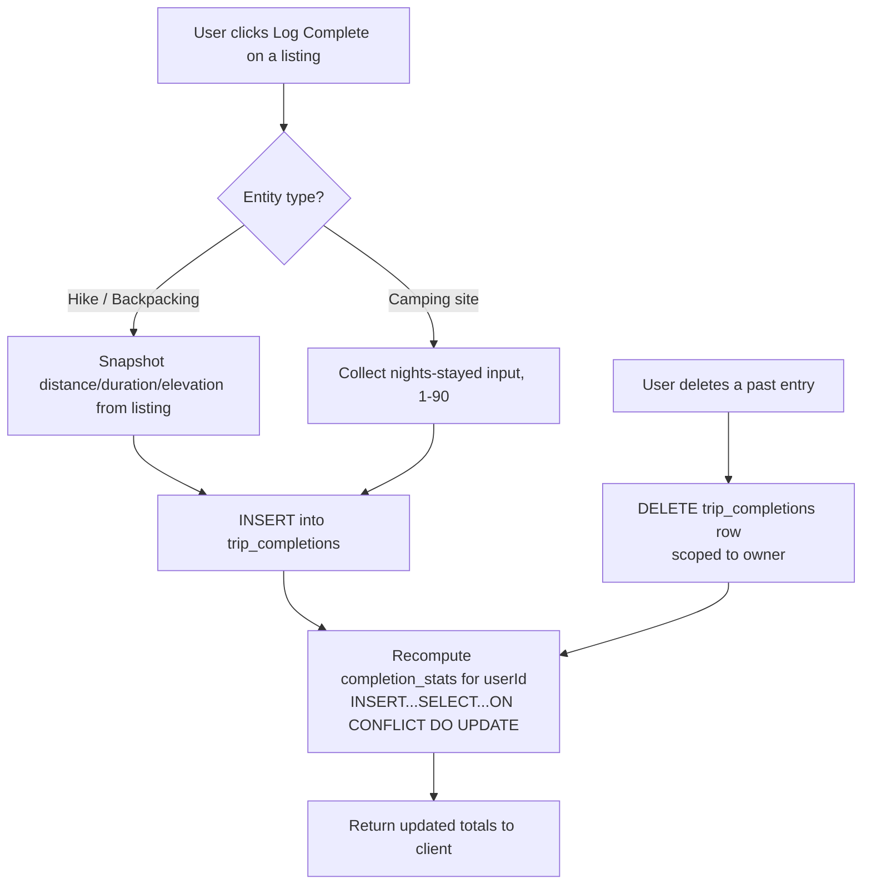
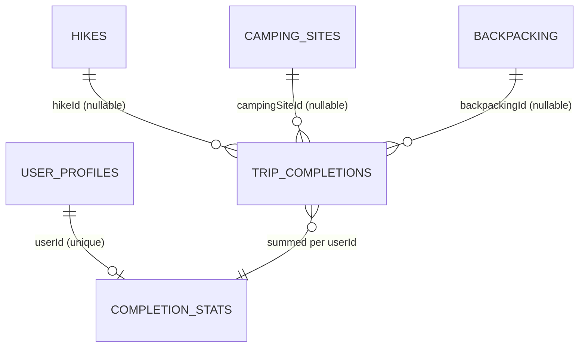

# Trip Completion Log - Plan

## Goal Capsule

- **Objective:** Implement self-reported trip completion logging for hikes, camping sites, and backpacking trips, with per-user lifetime totals (miles hiked, nights camped, trip count), per the Product Contract below.
- **Authority hierarchy:** Product Contract is authoritative for product scope. Planning Contract and Implementation Units are authoritative for technical approach. Do not invent product behavior beyond what's specified here.
- **Execution profile:** Standard-depth feature, six implementation units. U1 (schema) is foundational; U2 and U4 depend on U1; U3 depends on U1 and U2 (adds a `GET` handler to the same `+server.ts` file U2 creates); U5 depends on U2 and U3; U6 depends on U3 and U4.
- **Stop conditions:** All units complete, Verification Contract gates pass, Definition of Done criteria met.
- **Tail ownership:** Standard repo conventions — `npm run db:migrate` for schema changes, PR review via the repo's existing CI (`deploy-preview.yml` / `deploy-prod.yml`).
- **Open blockers:** none.

## Product Contract

**Product Contract preservation:** changed — R9 added (delete own log entries), and the Scope Boundaries "Deferred for later" list updated to match. Confirmed with the user during planning (flow analysis flagged the no-correction-mechanism gap as highest severity given there's no leader-approval workflow). All other Product Contract content unchanged from the brainstorm.

### Summary

Add a self-reported "Log as completed" action to hike, camping-site, and backpacking-trip listings. Each log entry captures the trip's stats — auto-filled from the listing where available, manually entered for camping nights-stayed — and rolls up into a private-by-default lifetime totals view, shareable via an opt-in toggle. Users can delete their own mistaken log entries.

### Problem Frame

Scouts and leaders currently duplicate distance/night bookkeeping by hand: this platform already stores trail distance, elevation, and duration for its own listings, but nothing on the platform — and nothing in BSA's own Scoutbook, which requires manual mileage entry — uses that data to save a scout from re-typing it into a personal record. Ideation on scouting-specific differentiation surfaced this as the platform's strongest independent bet: unlike unit/roster or leader-approval features, it needs no organizational data and delivers value from a single user's own logged trips alone.

### Key Decisions

- **Self-report, no verification.** Any signed-in user marks their own trips complete; no leader or parent approval gates a log entry. This is personal progress tracking, not the official merit-badge sign-off record, which still happens with a real counselor outside the app.
- **Raw totals only — no badge-name claims.** The dashboard shows lifetime miles hiked, nights camped, and trip counts. It never asserts a specific merit badge is "earned" or tracks program-specific thresholds, avoiding both admin-configurable requirement tables and an inaccurate official claim.
- **Private by default, shareable via toggle.** Mirrors the existing `showUnitInfo` privacy pattern on user profiles — a user's log and totals are visible only to them unless they opt in to sharing.
- **Multiple completions per entity are allowed.** Unlike `favorites` (unique per user per entity), a user can log the same hike or campsite complete more than once — each visit is its own entry.
- **Camping requires manual "nights stayed" entry.** Camping-site records only store site-level cost/season data, not per-visit duration, so nights-stayed is filled in by the user at logging time rather than supplied by the listing.
- **Users can delete their own log entries.** Added during planning: with no leader-approval step to catch mistakes, a basic self-service correction path is necessary. Deleting recomputes the user's totals.

### Actors

- A1. Any signed-in platform user (scout, parent, or leader) acting on their own account. No distinct roles are needed since there is no approval workflow.

### Requirements

**Logging a trip**

- R1. A signed-in user can mark a hike, camping site, or backpacking trip as completed from that listing's detail page.
- R2. For hikes and backpacking trips, the log entry auto-fills distance, duration, and elevation from the listing's existing data when present.
- R3. For camping sites, the user manually enters nights stayed when logging a completion; other stats are not auto-filled since camping sites don't track per-visit duration.
- R4. A user may log the same listing as completed more than once, each as an independent entry.
- R5. If a hike or backpacking trip's distance, duration, or elevation is unset on the listing, the user can still log a completion; the missing figures simply don't contribute to that entry's totals.

**Totals and display**

- R6. The platform maintains a running lifetime total per user of miles hiked, nights camped, and total trips completed, derived from that user's log entries.
- R7. Totals are visible only to the logging user by default.
- R8. A user can opt in to sharing their totals (e.g., visible on their profile), mirroring the existing unit-info visibility toggle pattern.

**Correcting a log**

- R9. A user can delete one of their own completion log entries; the deletion recomputes their lifetime totals to no longer include it.

### Acceptance Examples

- AE1. **Covers R2, R3.** Given a hike listing with `distance` set, When a user logs a completion, Then the entry auto-fills that distance. Given a camping-site listing, When a user logs a completion, Then they are prompted to enter nights stayed manually.
- AE2. **Covers R4.** Given a user has already logged a trail as completed once, When they log the same trail as completed again, Then a second independent entry is created and both count toward totals.
- AE3. **Covers R5.** Given a hike listing with `distance` left blank, When a user logs a completion, Then the entry saves successfully and contributes 0 to the mileage total rather than erroring.
- AE4. **Covers R7, R8.** Given a user has never changed their sharing setting, When another user views their profile, Then no completion totals are shown. When the user opts in to sharing, Then totals become visible on their profile.
- AE5. **Covers R9.** Given a user has logged a hike complete once, When they delete that log entry, Then it no longer appears in their history and their lifetime totals decrease by that entry's contributed miles.

### Scope Boundaries

**Deferred for later**

- Badge-threshold matching and admin-configurable merit-badge requirement tables — v1 shows raw totals, not badge-specific progress.
- Leader or parent approval workflow for logged completions.
- Freeform logging for trips to places not in the platform's catalog.
- Editing a past log entry's values (deletion is now in scope per R9, but correcting a wrong nights-stayed value in place is not — a user redoes it by deleting and re-logging).
- A public-facing surface for shared totals. No public profile page exists yet; this plan wires the sharing toggle and self-view only (see KTD5).

**Outside this product's identity**

- Any tie-in to unit/roster/leader-certification data — a separate, larger idea already deferred pending a build-vs-integrate decision against the user's sibling Unit Spark project.

### Dependencies / Assumptions

- Assumes the existing `distance`/`duration`/`elevation` fields on hike and backpacking listings are reliable enough to auto-fill from; accuracy of individual listings is out of scope here.
- Assumes camping sites will not gain a per-visit duration field as part of this work — nights-stayed stays a log-entry-level input, not a site-level one.

### Sources / Research

- `docs/ideation/2026-07-08-scouting-differentiation-features-ideation.html` — originating ideation entry, including the decision to defer roster/badge-threshold work pending the Unit Spark integration question.
- `src/lib/db/schemas/favorites.ts` — three-nullable-FK per-user-per-entity pattern; the completion log reuses this shape but drops the unique index (repeats are allowed).
- `src/lib/db/schemas/ratings.ts` — same three-FK shape plus a CHECK constraint enforcing exactly one FK is non-null; reused for the completion log table.
- `src/lib/db/schemas/rating-aggregates.ts` and `src/routes/api/ratings/+server.ts`'s `updateRatingAggregates()` — the denormalized-cache pattern (atomic `INSERT...SELECT...ON CONFLICT DO UPDATE`) the per-user stats aggregate follows, adapted from per-entity to per-user keying.
- `src/lib/db/schemas/hikes.ts`, `src/lib/db/schemas/backpacking.ts`, `src/lib/db/schemas/camping-sites.ts` — confirmed field names/types for `distance`/`duration`/`elevation`/`numberOfNights`, and confirmed camping sites have no per-visit duration field.
- `src/lib/db/schemas/user-profiles.ts` and `src/routes/profile/+page.server.ts` — the `showUnitInfo` toggle and its `onConflictDoUpdate` persistence pattern, mirrored for the new sharing toggle.
- `src/lib/components/` `FavoriteButton.svelte` — client-side pattern (optimistic update, auth-redirect-on-click, `onMount` state fetch) the new logging button follows structurally, adapted from a toggle to a repeatable action.
- `src/lib/allowed-fields.ts` — confirms `distance`/`duration`/`elevation` are user-alterable fields on live listings via the existing alteration-proposal workflow, which is why completion-log values must be snapshotted rather than re-derived live (see KTD1).

---

## Planning Contract

### Key Technical Decisions

- **KTD1 — Snapshot values at log time, never live-recompute.** `distance`/`duration`/`elevation` are user-alterable via the existing alteration-proposal workflow, so a listing's values can change after a user has already logged against it. The completion log row stores its own copy of the value and unit at write time; the per-user aggregate sums from the log rows themselves, never re-joins to the live entity. This keeps a user's lifetime totals stable and auditable — an admin or alteration approval editing a trail later does not silently rewrite anyone's history.
- **KTD2 — Reuse the three-nullable-FK shape, minus uniqueness.** The completion log table mirrors `favorites`/`ratings`: `hikeId`/`campingSiteId`/`backpackingId` nullable FK columns with `onDelete: "cascade"`, plus a CHECK constraint (from `ratings.ts`) enforcing exactly one is non-null. Unlike both existing tables, no unique index — R4 requires repeat logging. Kept over the discriminator-enum shape used by `moderation_queue.ts` (`entityType` + single `entityId`) because per-type FKs give referential integrity and per-entity-type cascade-delete semantics at the database level, which a single polymorphic `entityId` column can't express in Postgres.
- **KTD3 — Per-user aggregate recomputed via atomic upsert.** The `completion_stats` table (one row per user) is recomputed after every insert or delete using a single `INSERT ... SELECT ... ON CONFLICT DO UPDATE` against the user's own `trip_completions` rows, mirroring `updateRatingAggregates()`'s single-statement form — the same pattern chosen there specifically to avoid a race window a two-query read-then-write approach had. The recompute query must `COALESCE` each summed column to `0` (`SUM()` over an all-NULL group — e.g. a camping-only user, whose rows never set `distance` — returns `NULL` in Postgres, not `0`, which would otherwise contradict AE3 and the columns' "defaulting to 0" intent) and must convert kilometers-denominated rows before summing (e.g. `SUM(COALESCE(CASE WHEN distance_unit = 'kilometers' THEN distance * 0.621371 ELSE distance END, 0))`), since `distanceUnit` is a real per-listing choice (`distanceUnitEnum` = `["miles", "kilometers"]`) and KTD1 preserves each row's original unit rather than normalizing at write time.
- **KTD4 — Cascade delete on entity removal is accepted behavior.** If an admin deletes a hike/camping-site/backpacking listing, any completion log rows referencing it cascade-delete (matching `favorites`/`ratings`), and the user's aggregate shrinks accordingly on next recompute. This is a known, documented consequence of KTD2's FK shape, not a defect.
- **KTD5 — Sharing toggle lives on `user_profiles`, defaults to `false`.** Add `shareCompletionStats: boolean("share_completion_stats").default(false).notNull()` alongside `showUnitInfo`, using the same table and save-action pattern. Default is the inverse of `showUnitInfo`'s `true` default, since R7 requires private-by-default. No public profile page exists yet, so this plan persists and round-trips the flag but does not yet render shared totals to other viewers (see Scope Boundaries) — a future plan adds that surface.
- **KTD6 — Elevation is captured but not surfaced in v1 totals.** R6 names miles hiked, nights camped, and trip count only. Elevation is still snapshotted per-entry (cheap, and useful if a future view wants it) but the `completion_stats` aggregate and the profile UI do not sum or display it in this plan.
- **KTD7 — Nights-stayed validation: integer, 1–90.** Rejects 0, negative, and non-integer input. Chosen as a generous but sane bound for a single camping stay; adjustable later without a schema change.
- **KTD8 — Delete targets the log row's own ID, not entity-matched query params.** Because repeat logging is allowed, deleting "the completion for hike X" is ambiguous when more than one exists. `DELETE /api/completions/[id]` operates on the specific log row's primary key, scoped to `userId = session user`.

### High-Level Technical Design

Data flow for logging and correcting a completion:



Entity relationship shape (mirrors `ratings`/`favorites`, minus uniqueness, plus per-user aggregate):



### Assumptions

- The session/auth layer (`requireAuth()`) reliably exposes a stable `userId` usable as the FK target for both `trip_completions.userId` and `completion_stats.userId`, consistent with existing `favorites`/`ratings`/`user_profiles` usage.
- `db:migrate` (drizzle-kit push) is sufficient for adding two new tables and one new column; no data backfill is needed since this is new functionality with no prior rows.

---

## Implementation Units

### U1. Schema: completion log and per-user stats aggregate

**Goal:** Establish the data model for logging completions and tracking per-user lifetime totals.

**Requirements:** R1–R6, R9

**Dependencies:** none

**Files:**

- `src/lib/db/schemas/completions.ts` (new)
- `src/lib/db/schemas/completion-stats.ts` (new)
- `src/lib/db/schemas/user-profiles.ts` (modify — add `shareCompletionStats` column)
- `src/lib/db/schemas/index.ts` (modify — register new schema exports)

**Approach:** `completions.ts` defines `tripCompletions`: `id` (uuid pk), `userId` (text), three nullable FKs (`hikeId`/`campingSiteId`/`backpackingId`, each `onDelete: "cascade"`), a CHECK constraint requiring exactly one FK non-null (KTD2), a second CHECK constraint on `nights` (`nights IS NULL OR (nights >= 1 AND nights <= 90)`, mirroring `ratings.ts`'s `ratingValueCheck` per KTD7), snapshot columns (`distance`, `distanceUnit`, `duration`, `durationUnit`, `elevation`, `elevationUnit`, `nights`), `createdAt`. Plain (non-unique) indexes on `userId` and each FK column — no unique index. `completion-stats.ts` defines `completionStats`: `userId` (text, primary key), `totalMiles` (numeric), `totalNights` (integer), `tripCount` (integer), each defaulting to 0. Add `shareCompletionStats` boolean (default `false`) to `user-profiles.ts` per KTD5. Register both new files in `index.ts` following the existing `export * from "./..."` convention.

**Patterns to follow:** `src/lib/db/schemas/ratings.ts` (CHECK constraint shape, three-FK columns), `src/lib/db/schemas/favorites.ts` (FK/index shape, minus uniqueness), `src/lib/db/schemas/rating-aggregates.ts` (aggregate table shape, adapted to per-user).

**Test scenarios:**

- Migration applies cleanly via `npm run db:migrate`.
- Inserting a `trip_completions` row with zero FKs set is rejected by the CHECK constraint.
- Inserting a row with two FKs set is rejected by the CHECK constraint.
- Inserting a row with `nights` set to 0, negative, or above 90 is rejected by the CHECK constraint.
- Inserting two rows with the same `(userId, hikeId)` pair both succeed (no unique constraint blocks it).
- Deleting a referenced hike/camping-site/backpacking row cascades to delete its `trip_completions` rows.

**Verification:** `db.query.tripCompletions` and `db.query.completionStats` are queryable after migration; TypeScript types (`TripCompletion`, `NewTripCompletion`, `CompletionStats`) export correctly from their schema files.

---

### U2. API: create a completion log entry

**Goal:** Let a signed-in user log a trip as completed, with server-side auto-fill/snapshot and stats recompute.

**Requirements:** R1, R2, R3, R4, R5, R6. Covers AE1, AE2, AE3.

**Dependencies:** U1

**Files:**

- `src/routes/api/completions/+server.ts` (new — `POST` handler; also see U3 for `GET` on the same file)

**Approach:** Guard with `requireAuth()`. Accept `hikeId` / `campingSiteId` / `backpackingId` (exactly one) plus, for camping, a required `nights` field. For hikes/backpacking, look up the live listing's `distance`/`distanceUnit`/`duration`/`durationUnit`/`elevation`/`elevationUnit` and copy them onto the new row (null values snapshot as null/0 per AE3 — KTD1). For camping, validate `nights` as an integer in 1–90 (KTD7) and store it; other snapshot columns stay null. Plain `db.insert(tripCompletions).values(...)` — no `onConflictDoNothing`/`onConflictDoUpdate`, since repeats are allowed (simpler than the `favorites`/`ratings` POST handlers). After insert, recompute the user's `completion_stats` row via a single `INSERT ... SELECT ... ON CONFLICT DO UPDATE` summing `distance` (normalized to miles) and `nights` across that user's `trip_completions` rows (KTD3).

**Technical design:**

```
POST /api/completions
body: { hikeId? | campingSiteId? | backpackingId?, nights? }
  -> validate exactly one entity id present (400 otherwise)
  -> if campingSiteId: require integer nights in [1,90] (400 otherwise)
  -> if hikeId | backpackingId: snapshot distance/duration/elevation (+units) from live listing
  -> insert trip_completions row
  -> recompute completion_stats for userId (INSERT...SELECT...ON CONFLICT DO UPDATE,
     COALESCE each summed column to 0, convert kilometers rows to miles before summing — KTD3)
  -> 201 with the created row
```

**Patterns to follow:** `src/routes/api/ratings/+server.ts` for the `requireAuth()` guard, entity-count validation (`entityCount = [hikeId, campingSiteId, backpackingId].filter(Boolean).length`), and the `updateRatingAggregates()` atomic-upsert shape (adapt from per-entity to per-user keying).

**Test scenarios:**

- Happy path: logging a hike with `distance` set auto-fills that distance onto the new row and the user's `completion_stats.totalMiles` increases accordingly.
- Happy path: logging a camping site with `nights: 3` creates a row with `nights: 3` and no distance/duration/elevation; `completion_stats.totalNights` increases by 3.
- Edge case: logging a hike with `distance` null succeeds and contributes 0 to `totalMiles` (covers AE3).
- Edge case: a user whose only logged completion is a camping site has `completion_stats.totalMiles = 0`, not `NULL` (KTD3 COALESCE).
- Edge case: logging a hike with `distanceUnit: "kilometers"` contributes the correct miles-converted value to `totalMiles` (KTD3).
- Edge case: logging the same hike twice creates two independent rows; `completion_stats` reflects the sum of both (covers AE2's downstream effect on totals).
- Error path: request with zero of `hikeId`/`campingSiteId`/`backpackingId` set returns 400.
- Error path: request with more than one of the three set returns 400.
- Error path: camping request with missing, zero, negative, or non-integer `nights` returns 400.
- Error path: unauthenticated request returns 401.
- Integration: after a successful POST, a subsequent `GET /api/completions/my-stats` (U4) reflects the new totals.

**Verification:** Manually POST against a seeded hike/camping-site/backpacking record in a dev environment and confirm the response row and updated stats match expectations for each entity type.

---

### U3. API: list and delete completion log entries

**Goal:** Let a user view their own logged history and delete a mistaken entry.

**Requirements:** R6 (supports totals display), R9. Covers AE5.

**Dependencies:** U1, U2 (adds a `GET` handler to the `+server.ts` file U2 creates)

**Files:**

- `src/routes/api/completions/+server.ts` (modify — add `GET` handler alongside U2's `POST`)
- `src/routes/api/completions/[id]/+server.ts` (new — `DELETE` handler)

**Approach:** `GET /api/completions` is always scoped to `userId = session user` (no viewing another user's raw entries, regardless of their sharing toggle — sharing only exposes the aggregate, not the entry list, per Scope Boundaries). Accepts optional `hikeId`/`campingSiteId`/`backpackingId` query params to filter to a single entity (used by the detail-page button in U5 to show "logged N times"); with no filter, returns all of the caller's entries (used by the profile history view in U6), ordered by `createdAt` descending, paginated via `parseLimit()`/`parseOffset()` from `$lib/utils/pagination.ts` matching the repo's other list endpoints (e.g. `GET /api/ratings`). Each returned row joins to its hike/camping-site/backpacking record (via whichever FK is non-null) to include the entity's name and slug, so the history view in U6 can identify which trip each entry belongs to. `DELETE /api/completions/[id]` loads the row by its primary key, verifies `row.userId === session user` (403 if not, 404 if the row doesn't exist), deletes it, recomputes `completion_stats` for that user the same way U2 does after insert (KTD3, KTD8), and returns the updated totals in its response body so U6 can apply them directly without a second request.

**Patterns to follow:** `src/routes/api/favorites/[id]/+server.ts` for the auth-guarded single-row handler shape; note this unit's `DELETE` targets the log row's own ID directly rather than entity-matched query params, unlike favorites (KTD8).

**Test scenarios:**

- `GET /api/completions` returns only the caller's own entries, never another user's.
- `GET /api/completions?hikeId=<id>` filters to entries for that hike only.
- `GET /api/completions` returns each row with its entity's name/slug joined in.
- `GET /api/completions` respects `limit`/`offset` query params and returns entries ordered newest-first.
- `DELETE /api/completions/[id]` on the caller's own entry removes it, `completion_stats` decreases by that entry's contribution (covers AE5), and the response body includes the updated totals.
- `DELETE /api/completions/[id]` on another user's entry returns 403.
- `DELETE /api/completions/[id]` on a nonexistent ID returns 404.
- Unauthenticated `GET` or `DELETE` returns 401.

**Verification:** Log two entries for the same hike, delete one via the API, and confirm the remaining entry and updated stats are correct.

---

### U4. API: expose stats and persist the sharing toggle

**Goal:** Let a user read their own lifetime totals and set their sharing preference.

**Requirements:** R7, R8

**Dependencies:** U1

**Files:**

- `src/routes/api/completions/my-stats/+server.ts` (new — `GET` handler)
- `src/routes/profile/+page.server.ts` (modify — extend the existing profile save action to persist `shareCompletionStats`)

**Approach:** `my-stats` returns the caller's `completion_stats` row, defaulting to zeros (`totalMiles: 0, totalNights: 0, tripCount: 0`) when no row exists yet (a user with no logged completions). No-store cache header, matching `ratings`'s per-user endpoints (response reflects live, user-scoped state). Extend the existing `?/saveProfile` form action (or add a sibling action) to accept and persist `shareCompletionStats` via the same `onConflictDoUpdate` pattern already used for `showUnitInfo`.

**Patterns to follow:** `src/routes/api/ratings/my-rating/+server.ts`-equivalent single-resource `GET` shape; `src/routes/profile/+page.server.ts`'s existing save-action `onConflictDoUpdate` for `user_profiles`.

**Test scenarios:**

- `GET /api/completions/my-stats` for a user with no completions returns all zeros.
- `GET /api/completions/my-stats` reflects correct sums after one or more completions are logged (integration with U2/U3's recompute step).
- Saving the profile form with the sharing toggle enabled persists `shareCompletionStats: true` and round-trips on reload.
- Unauthenticated `GET /api/completions/my-stats` returns 401.

**Verification:** Toggle sharing on and off via the profile form and confirm the persisted value survives a page reload.

---

### U5. UI: Log-completion button and camping nights form

**Goal:** Let a user log a completion from a hike, camping-site, or backpacking-trip detail page.

**Requirements:** R1, R2, R3, R4. Covers AE1, AE2.

**Dependencies:** U2, U3 (the button's `onMount` state fetch relies on U3's `GET /api/completions` handler)

**Files:**

- `src/lib/components/LogCompletionButton.svelte` (new)
- Detail page components under `src/lib/components/detail-pages/` or the relevant hike/camping/backpacking detail route (modify — render the new button alongside the existing favorite/rating UI)

**Approach:** Structurally mirror `FavoriteButton.svelte` (props for `hikeId`/`campingSiteId`/`backpackingId`/`userId`; `onMount` fetch of the current logged count via `GET /api/completions?<entityId>`; redirect to `/login` on click when unauthenticated), but this is **not a toggle** — every click creates a new entry. The log button (and the camping form's submit button) is disabled from click until its request resolves, guarding against an accidental double-click creating a duplicate entry — distinct from the intentional repeat-click behavior below, which is allowed once each prior request has completed. For hikes and backpacking, a click posts immediately (no user input required) with an optimistic count increment, rolled back — with a brief inline error ("Couldn't log this trip — try again") — on request failure. For camping sites, a click expands a small inline form collecting `nights` (client-side validated 1–90 before submit, matching KTD7) instead of posting immediately; on successful submission the form collapses/resets and the visible count increments the same way the hike/backpacking path does, and on failure it shows the same inline error without collapsing so the user can retry.

**Test scenarios:**

- Clicking the button on a hike/backpacking detail page creates a completion and the visible "logged N times" count increments.
- Clicking the button on a camping-site detail page opens the nights-stayed form; submitting a valid value (1–90) creates the entry; submitting 0, a negative number, or a non-integer is rejected client-side without a request.
- Repeated clicks on the same listing each create a new entry once each prior request has resolved (verifies non-toggle behavior, covers AE2 from the client side).
- The button is disabled while a request is in flight, so a rapid double-click only creates one entry.
- A failed POST (simulated network error) rolls the optimistic count back and shows an inline error.
- Submitting the camping nights form successfully collapses the form and increments the visible count.

**Verification:** Manually exercise the button on one listing of each entity type in a dev environment; confirm counts update correctly and the camping form validates before submission.

---

### U6. UI: Profile "My Adventures" stats and history

**Goal:** Let a user see their lifetime totals, browse their logged history, delete entries, and control sharing.

**Requirements:** R6, R7, R8, R9. Covers AE4, AE5.

**Dependencies:** U3, U4

**Files:**

- `src/routes/profile/+page.svelte` (modify — add a new tab)
- `src/routes/profile/+page.server.ts` (modify — load stats and history for the new tab; already extended in U4 for the save action)

**Approach:** Add a new entry to the existing `tabs` array (alongside `profile`/`security`/`notes`). The new tab renders: lifetime totals from `GET /api/completions/my-stats` (U4); a list of the user's past entries from `GET /api/completions` (U3), each labeled with the entity's name (from U3's join) and a delete button wired to `DELETE /api/completions/[id]` (U3); the sharing toggle using the same toggle-switch markup as `showUnitInfo`, submitted through the profile save action (U4). The delete button requires a confirmation step (stating what will be removed and that totals will decrease) before the `DELETE` request fires. On a confirmed delete, the entry is removed from the visible history and the totals shown update directly from the `DELETE` response body (U3) — no separate re-fetch.

**Patterns to follow:** The existing "Scout Unit" card block in `+page.server.ts`/`+page.svelte` (bordered card, `peer`/`peer-checked` toggle-switch markup, `use:enhance` form submission) as the template for both the sharing-toggle UI and the overall tab layout.

**Test scenarios:**

- The new tab renders correct lifetime totals for a user with existing completions.
- The new tab renders "no completions yet" (or equivalent) state correctly for a user with zero entries.
- Each history entry displays the name of the trip it belongs to.
- Clicking delete on an entry requires confirmation before the request fires; canceling the confirmation leaves the entry untouched.
- Confirming delete removes the entry from the visible list and the displayed totals decrease accordingly, applied from the `DELETE` response without a separate re-fetch (covers AE5).
- Toggling sharing on, reloading the page, and confirming the toggle state persists (covers AE4's persistence half).
- Test expectation: this plan does not add a public surface that reads the sharing toggle, so there is no test for "another user sees shared totals" — that's explicitly out of scope (see Scope Boundaries) and belongs to a future plan.

**Verification:** Log a few completions across entity types, confirm the profile tab reflects correct totals, delete one, confirm totals and the list both update, then toggle and reload to confirm the sharing preference persists.

---

## Verification Contract

- **Type checking:** `npm run check` must pass after schema and route changes (TypeScript strict mode, `svelte-check`).
- **Linting:** `npm run lint` must pass.
- **Unit tests:** `npm run test:unit` — add Vitest coverage for the recompute-aggregate logic (U2/U3) and the entity/nights validation logic (U2), since these are the units with the most edge-case surface.
- **E2E tests:** `npm run test:e2e` — extend Playwright coverage to cover the log → view totals → delete → totals update round trip (U5/U6), following the existing e2e patterns already covering favorites/ratings flows.
- **Migration:** `npm run db:migrate` must apply cleanly against a preview database before this ships, consistent with the repo's CI gating (migrations run before deploy in both `deploy-preview.yml` and `deploy-prod.yml`).
- No `release:validate` or behavioral-skill-evaluation gate applies — this is a standard CRUD feature, not an agent/skill-facing change.

## Definition of Done

**Global:**

- All six implementation units complete and merged.
- `npm run check`, `npm run lint`, `npm run test:unit`, and `npm run test:e2e` all pass.
- `npm run db:migrate` has been run against the preview environment and the new tables/column exist as designed.
- No dead-end or experimental code from abandoned approaches remains in the diff (e.g., no leftover discriminator-enum attempt if the three-FK shape was chosen after trying alternatives during implementation).

**Per-unit:**

- U1: migration applies cleanly; CHECK constraint and non-unique indexes verified via the schema-level test scenarios.
- U2: all POST test scenarios pass, including the entity-validation and nights-validation error paths.
- U3: GET/DELETE scoping and 403/404 test scenarios pass.
- U4: my-stats returns correct data for both zero-completion and populated users; sharing toggle round-trips.
- U5: button behavior verified manually or via e2e for all three entity types, including the camping nights-form validation.
- U6: profile tab renders totals/history correctly and reflects deletions and sharing-toggle changes.
